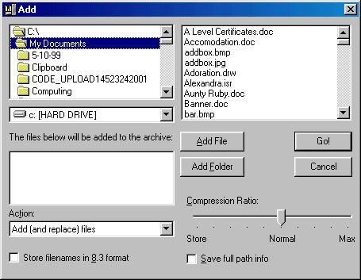



## VBZip \- Add standard ZIP compression to your Apps

### Description

Add standard ZIP compression and decompression to your Apps by simply adding this comtrol to a form.

 

New version of Richsoft ZipIt 1b

 

Fully updated, now sample WinZip style application is complete!

 

* Add, extract, delete files from an archive

 

* Fully event driven

 

* 9 levels of compression

 

* 8.3 format for compatablity with PKZip for DOS

 

* Fully compatible with WinZip!

 

* Wildcards now supported for all archive operations!

 

For latest information please see my website:

www.richsoftcomputing.btinternet.co.uk

 

The Zip file was created using the sample application!
 
### More Info
 
Please read the Readme file in the archive.

None I hope :)

             |
---                |---
**Submitted On**   |2001-02-26 20:34:56
**By**             |[Richard Southey](https://github.com/Planet-Source-Code/PSCIndex/blob/master/ByAuthor/richard-southey.md)
**Level**          |Intermediate
**User Rating**    |4.8 (81 globes from 17 users)
**Compatibility**  |VB 5\.0, VB 6\.0
**Category**       |[Files/ File Controls/ Input/ Output](https://github.com/Planet-Source-Code/PSCIndex/blob/master/ByCategory/files-file-controls-input-output__1-3.md)
**World**          |[Visual Basic](https://github.com/Planet-Source-Code/PSCIndex/blob/master/ByWorld/visual-basic.md)
**Archive File**   |[CODE\_UPLOAD155232262001\.zip](https://github.com/Planet-Source-Code/richard-southey-vbzip-add-standard-zip-compression-to-your-apps__1-21354/archive/master.zip)

